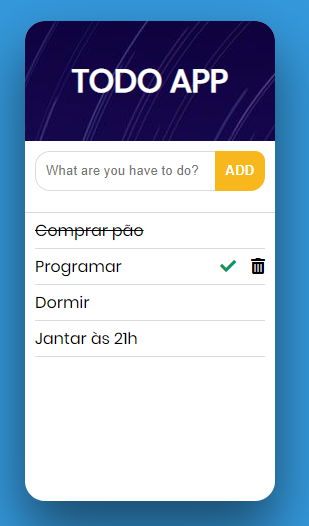

# ToDo-App

A simple application in HTML5, CSS and Vanilla JavaScript to practice web development.

Demo: [ToDo-APP](https://juliomiguell.github.io/ToDo-App).

References: I made this project based in a instagram *coding* called [webcodemode](https://www.instagram.com/webcodemode/).

> Aprender é repetir tanto quanto necessário para que a técnica integre-se a sua forma de pensar!
